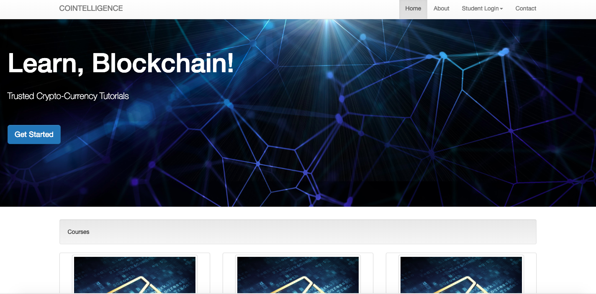
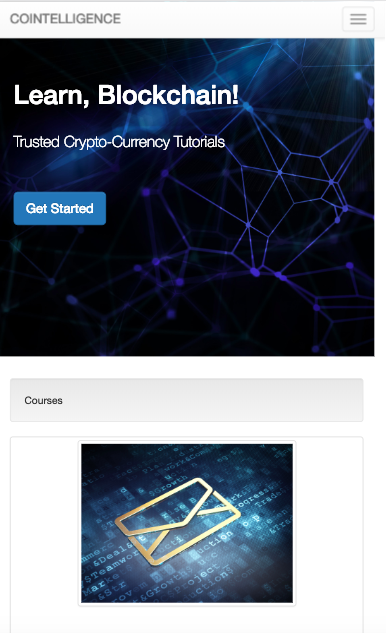

# Responsive Bootstrap Website for Blockchain Tutorials

 A **responsive frontend website** using the Bootstrap 3.7 framework. The purpose of the website is to provide intuitive tutorials on Blockchain. The website contains several working pages which are the home page, about us and the contact page which features a responsive form.

## Features

- Responsive
- Suitable responsive images
- Responsive Navbar with hamburger menu for smaller screen sizes
- Ready to customize for **similar front-end projects**
- organised file structure

## Responsive images

